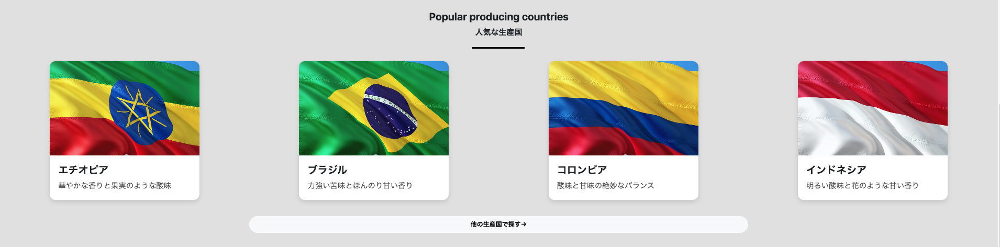
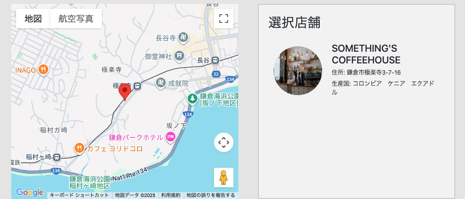
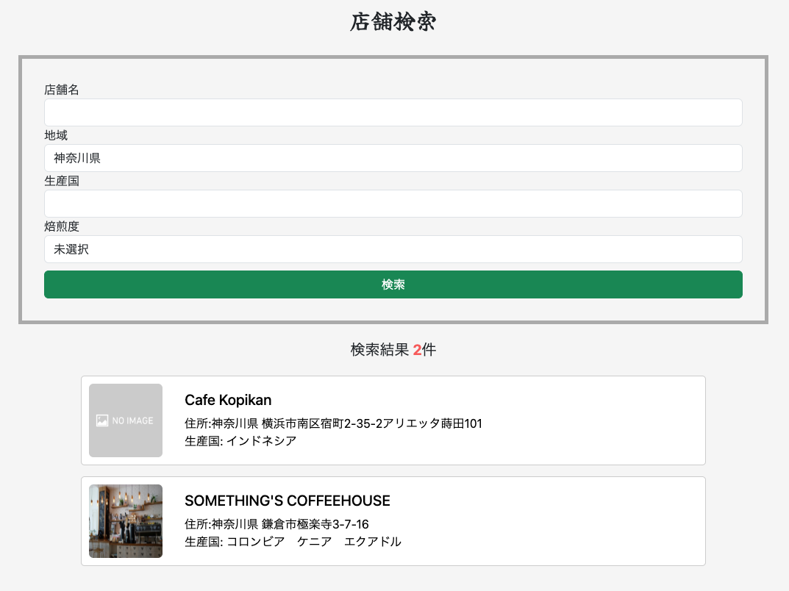
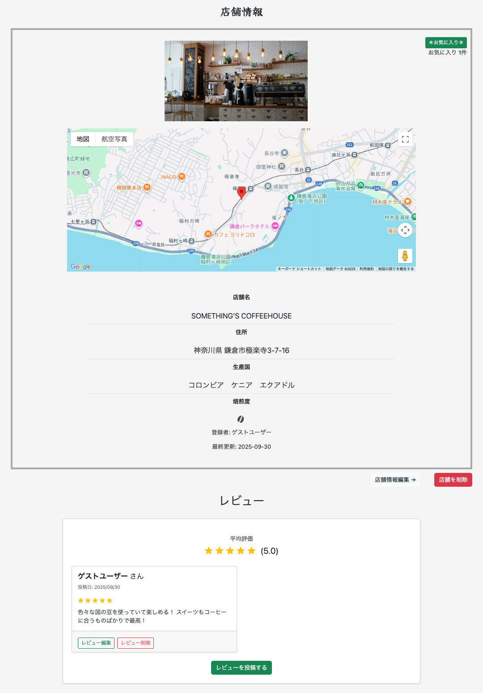
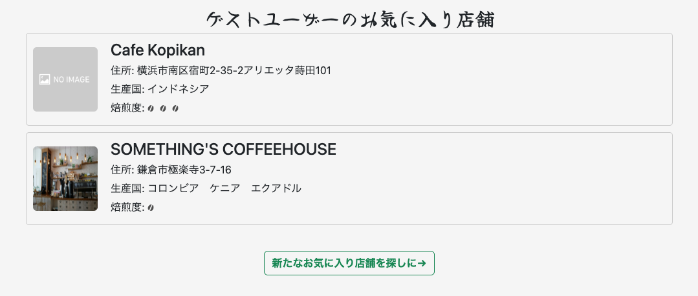
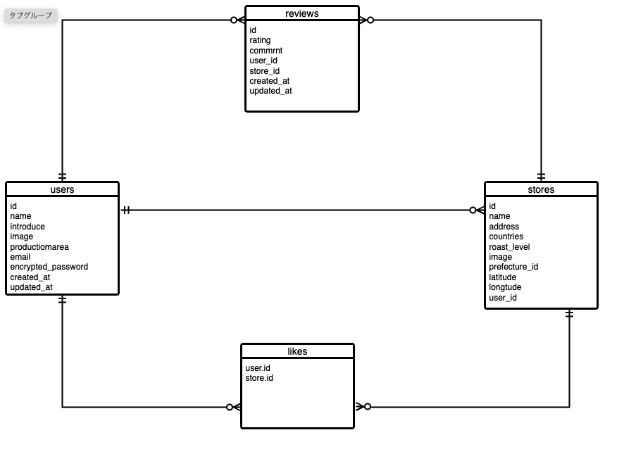

# こそこそ珈琲研究室
お気に入りの珈琲が見つかる検索サイト

## 概要
「こそこそ珈琲研究室」は、全国のカフェ店舗を登録・検索・共有できるWebアプリです。
Google Maps を用いた直感的な地図検索やレビュー投稿機能を通じて、
自分にぴったりのコーヒーに出会える体験を提供します。
カフェ店舗を登録し、共有できるアプリです。

## 主な機能
- 店舗登録（店舗名・住所・生産国・焙煎度・画像）
- 店舗検索（名前、都道府県、生産国、焙煎度）
- Google Maps による地図表示・位置情報検索
- レビュー投稿・星評価機能
- お気に入り店舗管理

## 使用技術
- フロントエンド：HTML&CSS / JavaScript / Bootstrap
- バックエンド：Ruby / Ruby on Rails
- テスト：RSpec / FactoryBot
- ActiveHash：都道府県のデータ管理
- AWS S3：画像アップロードの保存
- Google Maps API / Geocoding API：地図表示・位置情報検索
- Heroku：本番環境へのデプロイ

## ページ紹介

### 1. トップページ
- アプリの入口ページ。
- 検索フォーム、人気生産国カード、地図など直感的に検索が可能





---

### 2. 店舗検索ページ
- 名前、都道府県、生産国、焙煎度で検索した結果を一覧表示
- ページ遷移せずに条件を変えて再検索可能
- 店舗名、地域、生産国、焙煎度を直感的に確認
- クリックで店舗詳細ページへアクセス可能



---

### 3. 店舗詳細ページ
- 店舗名、住所、生産国、画像を表示
- Google Maps と連携して店舗位置を表示
- **レビュー投稿・閲覧機能**
- ログインユーザーが店舗ごとにレビューを投稿可能
- 星評価やコメントで店舗情報を共有
- お気に入り登録ボタンで自分の気になった店舗を登録することが可能。



---

### 4. お気に入りページ（ログイン後）
- 登録したお気に入り店舗を一覧で管理
- 店舗名、住所、生産国、焙煎度、画像を確認可能
- クリックで店舗詳細ページへアクセス可能
- 「新たなお気に入り店舗を探しに→」ボタンで検索ページに移動可能



## DB設計



## 今後の改善点
- ユーザー同士のフォロー機能
- レビューに画像添付機能
- 店舗登録時の認証機能

## 補足
- アプリ内で使用している画像は、著作権フリー素材を利用しています。
- スクリーンショット画像は本アプリの実際の画面をキャプチャしたものです。

---

## インストール方法
```bash

git clone https://github.com/Otkr519/coffeeapp.git

cd coffeeapp

bundle install

rails db:create db:migrate db:seed

rails server

